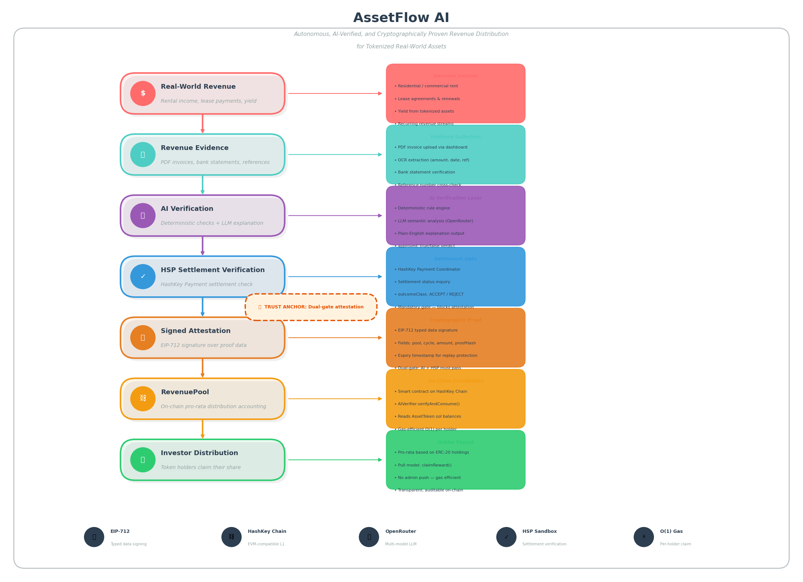
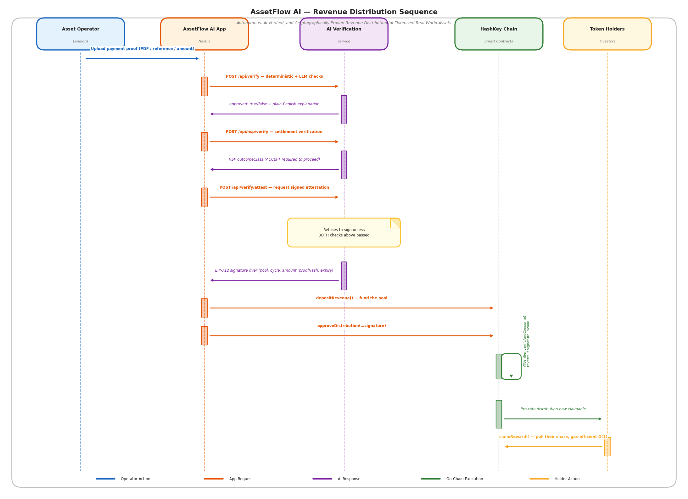

# 🏢 AssetFlow AI

**The Autonomous Settlement Intelligence Layer for Tokenized Real-World Assets**

---

## 🌐 Mainnet Deployment

AssetFlow AI is **deployed and verified** on **HashKey Chain Mainnet** (Chain ID: 177):

| Contract        | Address                                      | Explorer                                                                                            |
| --------------- | -------------------------------------------- | --------------------------------------------------------------------------------------------------- |
| **AssetToken**  | `0x6f33584fDAcC43ce160E0Bc6f7779c5224016690` | [View on Blockscout](https://hsk.blockscout.com/address/0x6f33584fDAcC43ce160E0Bc6f7779c5224016690) |
| **AIVerifier**  | `0x4529Ea3e070CBBbB27D2A6Ff56aBA21C2cD7bc6D` | [View on Blockscout](https://hsk.blockscout.com/address/0x4529Ea3e070CBBbB27D2A6Ff56aBA21C2cD7bc6D) |
| **RevenuePool** | `0x39937C914cDdeDe9133d02211aE29DBcC7cD7146` | [View on Blockscout](https://hsk.blockscout.com/address/0x39937C914cDdeDe9133d02211aE29DBcC7cD7146) |

**Deployer**: [`0x3d82C1FC101F522b7F770EFafaBE7F247993deCF`](https://hsk.blockscout.com/address/0x3d82C1FC101F522b7F770EFafaBE7F247993deCF)  
**AI Signer**: [`0x4825fA85e12118033C2E87c0DbB9d8e54781d71f`](https://hsk.blockscout.com/address/0x4825fA85e12118033C2E87c0DbB9d8e54781d71f)

All contracts are **source-verified** - anyone can inspect the Solidity code directly on the explorer.

---

## 🧠 What is AssetFlow AI? (The "Explain it to me like I'm 5" version)

Imagine you and 124 other people own a commercial building. Every month, the building collects $15,000 in rent.

**The Old Way:** The property manager collects the cash, puts it in a bank, hires an accountant to verify it, and then wires the money to 125 different bank accounts. It takes weeks, costs thousands in fees, and you just have to _trust_ the manager did it right.

**The AssetFlow AI Way:**

1. The manager uploads a digital receipt to our app.
2. An **AI** verifies the submitted revenue evidence against the expected lease terms and produces an explainable settlement recommendation.
3. **HSP (HashKey Settlement Protocol)** cryptographically verifies the settlement evidence according to its trust model before allowing the distribution workflow to continue.
4. A **Smart Contract** instantly splits the $15,000 and sends it to the 125 investors' wallets.

**Result:** Instant, transparent, trustless distribution. No middlemen. No waiting.

---

## 🎯 Why AssetFlow AI?

Tokenized real-world assets are rapidly growing, but one major operational problem remains:

- Revenue generated in the real world still requires manual verification before it can be distributed on-chain.
- Property managers, accountants, and administrators become trusted intermediaries.
- Investors have no standardized, independently verifiable settlement authorization before funds are distributed.

AssetFlow AI removes this operational bottleneck by combining **explainable AI**, **HSP settlement verification**, and **programmable smart contracts** into a single autonomous distribution workflow.

---

## ⛓️Why Blockchain?

Revenue distribution needs to be transparent, tamper-resistant, and independently auditable. Smart contracts ensure that once revenue is verified, the distribution rules execute exactly as defined, without relying on a centralized operator.

---

## 🏗️ Architecture Overview

<p align="center">
  
</p>

### Revenue Distribution Flow

<p align="center">
  
</p>

---

## 🔐 HSP Integration (HashKey Settlement Protocol)

AssetFlow AI uses **HSP (HashKey Settlement Protocol)** as the cryptographic settlement verification layer. This is the core innovation that separates us from naive "AI approves → smart contract executes" systems.

### How We Use HSP

1. **Capability-Based Verification**: Every settlement must satisfy a set of required capabilities:
   - `AMOUNT_MATCH` - Receipt amount matches expected lease payment
   - `REFERENCE_UNIQUE` - No duplicate settlement reference detected
   - `DUE_DATE_VALID` - Receipt date falls within the contractual window

2. **Pinned Trust Anchors**: The adapter address is pinned in environment variables and **never re-fetched dynamically**. This prevents man-in-the-middle attacks where a malicious coordinator could swap trust roots.

3. **Subset Decision Rule**: The verifier enforces the core HSP invariant:

   ```
   ACCEPT ⇔ requiredCapabilities ⊆ satisfiedCapabilities
   ```

   If any required capability is missing, the distribution is blocked - no exceptions.

4. **Mock Fallback**: For demo continuity, if the live HSP coordinator is unreachable, the app falls back to a `MockHSPAdapter` that preserves the **exact same interface and capability rule**. The frontend and backend code never changes.

### Why This Matters

Without HSP, the AI's decision is just a database flag that anyone with backend access could flip. With HSP, the settlement evidence is cryptographically bound to the mandate, and the verifier's decision is deterministic and reproducible by any third party.

---

## 🤖 Explainable AI Verification

Our AI verifier doesn't just say "Approved" or "Rejected" - it provides **institutional-grade explainability**:

```json
{
  "approved": true,
  "confidence": 98,
  "reason": "Amount matches lease, no duplicates detected, and receipt date is within the settlement window.",
  "risks": [],
  "analysis": [
    "✓ Amount matches lease schedule",
    "✓ Due date within covenant window",
    "✓ No duplicate settlement reference detected"
  ]
}
```

This structured JSON output allows auditors, regulators, and investors to understand **exactly why** a settlement was approved - no black boxes.

---

## ⛓️ Smart Contract Security

### AIVerifier.sol - EIP-712 Attestation with Replay Protection

The AI's approval is cryptographically signed using **EIP-712 typed data** and stored on-chain. Key security features:

- **Replay Protection**: Each `(pool, cycle)` pair can only consume an attestation once. Attempting to reuse the same signature reverts with `"cycle already consumed"`.
- **Expiry Window**: Attestations are time-bound (24-hour validity) to prevent stale approvals.
- **Pool Whitelisting**: Only approved `RevenuePool` contracts can consume attestations, preventing unrelated contracts from burning cycles.
- **Separation of Keys**: The `aiSigner` key **never holds gas and never sends transactions** - it only signs. This is separate from the deployer/owner key.

### RevenuePool.sol - Trustless Distribution Engine

- **Checks-Effects-Interactions Pattern**: All state changes happen before ETH transfers to prevent reentrancy.
- **ReentrancyGuard**: Additional protection on `claimReward()`.
- **Owner-Gated Approval**: Only the owner can submit distributions, but the **actual authority** lives in the AI signature - the owner key alone cannot approve a distribution without a valid attestation.

---

## ✨ Demo Highlights

- **Exactly 6 polished demo screens** built with Next.js App Router, Tailwind CSS, and shadcn-style UI components.
- **Exactly 3 Solidity smart contracts**: `AssetToken.sol`, `AIVerifier.sol`, and `RevenuePool.sol`.
- **Explainable Revenue verification** that doesn't just say "yes", but tells you _why_ (returning strict JSON).
- **Pinned HSP trust model** with a live adapter path and a drop-in mock fallback that preserves the same interface.
- **Local JSON storage** for asset, verification, and investor state (no complex database setup required).
- **10 seeded investors** with deterministic wallet addresses and distribution allocations.
- **Wallet-signed settlement path** that deposits demo revenue and calls `RevenuePool.approveDistribution()` directly from the frontend.
- **Mainnet deployment** with all contracts source-verified on HashKey Chain Blockscout.

---

## 🛠️ Tech Stack

| Layer                | Technology                                     | Why we chose it                                                            |
| :------------------- | :--------------------------------------------- | :------------------------------------------------------------------------- |
| **Frontend / API**   | Next.js 14, React 18, TypeScript, Tailwind CSS | Fast, modern, and makes building beautiful UIs easy.                       |
| **Smart Contracts**  | Hardhat + Solidity 0.8.24                      | The industry standard for writing and testing Ethereum-compatible code.    |
| **Web3 Interaction** | ethers v6                                      | The most robust library for talking to the blockchain from JavaScript.     |
| **Storage**          | Local JSON files (`data/`)                     | **Zero setup.**                                                            |
| **AI Provider**      | OpenAI-compatible API                          | Allows for complex reasoning and structured JSON output.                   |
| **Settlement**       | HSP (Pinned Adapter)                           | Provides cryptographic proof of settlement, not just server-side promises. |
| **Blockchain**       | HashKey Chain (Mainnet)                        | Production-grade L1 with verified contracts on Blockscout.                 |

---

## 🚀 Quick Start Guide (Step-by-Step)

_Follow these steps exactly. We have removed all unnecessary complexity so you can get the demo running._

### Prerequisites

Before you begin, ensure you have the following installed on your computer:

- **Node.js** (Version 18 or higher). [Download here](https://nodejs.org/).
- **Git**. [Download here](https://git.com/).

### Step 1: Download and Install Dependencies

Open your terminal (Command Prompt on Windows, Terminal on Mac/Linux) and run:

```bash
# 1. Clone the project to your computer
git clone https://github.com/Abdulazeez41/AssetFlow-AI
cd AssetFlow-AI

# 2. Install all the required software libraries
npm install
```

### Step 2: Configure Your Environment

The app needs a configuration file to know where to find its "secret keys" (like AI API keys).

```bash
# Create a local environment file from our template
cp .env.example .env.local
```

_💡 **Dummy Tip:** Open `.env.local` in a text editor. For this hackathon demo, the app is designed to work **out-of-the-box** using mock services. You do not need to fill in real API keys to see the demo work! Just leave the defaults as they are._

### Step 3: Create the "Fake World" (Seeding)

Right now, the app is empty. We need to create "Building A" and our 10 fake investors so you have something to look at.

```bash
# This generates the mock building, lease, and investors
npm run seed
```

### Step 4: Start the Application

```bash
# Start the web server
npm run dev
```

🎉 **Success!** Open your web browser and go to **`http://localhost:3000`**. You should see the AssetFlow AI Landing Page.

---

### 🌐 Optional: Running the Live Blockchain (For the full Web3 experience)

If you want to actually see the smart contracts execute on a local blockchain (highly recommended for the live demo):

1. Open a **second terminal window** and start a fake local blockchain:

   ```bash
   npx hardhat node
   ```

   _(Leave this window running! It will output a list of fake wallet addresses and private keys)._

2. Go back to your **first terminal window** and deploy the contracts to this fake blockchain:

   ```bash
   npm run contracts:compile
   npm run contracts:deploy:local
   ```

3. The script will output the new contract addresses. Copy them and paste them into your `.env.local` file:

   ```env
   NEXT_PUBLIC_REVENUE_POOL_ADDRESS=0x...
   NEXT_PUBLIC_AI_VERIFIER_ADDRESS=0x...
   NEXT_PUBLIC_ASSET_TOKEN_ADDRESS=0x...
   HASHKEY_RPC_URL=http://127.0.0.1:8545
   ```

4. Restart your Next.js app (`Ctrl+C` then `npm run dev`).

---

## 🗺️ Roadmap

- [ ] Real payment-processor / oracle integration instead of manual proof upload
- [ ] Multi-asset support (multiple properties/royalty streams per pool)
- [ ] Route the holder payout leg through HSP `pay()` directly for full settlement-layer auditability, not just the approval leg
- [ ] Cross-chain settlement adapters (Polygon, Arbitrum, Base)
- [ ] Timelock/multisig on `AIVerifier.setAISigner()` for production key rotation
- [ ] Richer deterministic fraud-signal detection ahead of the LLM explanation layer

---

## 📂 Project Structure

```text
assetflow-ai/
├── app/                # Next.js App Router (The 6 UI screens)
├── components/         # Reusable UI components (shadcn style)
├── contracts/          # Solidity Smart Contracts (Hardhat)
├── data/               # Local JSON storage (Investors, Assets, Verifications)
├── lib/                # Core logic (AI service, HSP adapter, Web3 helpers)
├── public/             # Static assets (receipt.pdf, images, logo)
├── scripts/            # Hardhat deployment and seeding scripts
└── docs/               # Deep-dive documentation
```

---

## 📚 Documentation Index

Want to dive deeper into the code? We've got you covered:

- [🏗️ Architecture Overview](docs/architecture.md) - How the pieces fit together.
- [📁 Folder Structure](docs/folder-structure.md) - Where to find specific files.
- [🔌 API Documentation](docs/api.md) - How the Next.js backend routes work.
- [⛓️ Smart Contract Documentation](docs/contracts.md) - Deep dive into the 3 Solidity contracts.
- [⚙️ Environment Variables](docs/env.md) - Explanation of every configuration option.

---

## 🐛 Troubleshooting

**"Port 3000 is already in use"**  
Another app is using port 3000. Run `npm run dev -- -p 3001` to start on a different port, or kill the other process.

**"MetaMask is not connecting / showing wrong network"**  
For the local demo, ensure your Hardhat node is running (`npx hardhat node`). In MetaMask, add a "Custom Network" with RPC URL `http://127.0.0.1:8545` and Chain ID `31337`. Import one of the private keys printed in the Hardhat terminal.

For the **mainnet demo**, switch MetaMask to HashKey Chain Mainnet (Chain ID 177, RPC: `https://mainnet.hsk.xyz/`).

**"The Revenue verification is failing"**  
Check your `.env.local`. If you don't have an `OPENROUTER_API_KEY`, the app is designed to use a deterministic fallback mock. Ensure your internet connection is stable if using the live API.

**"AI Signer private key not configured"**  
You need to set `AI_SIGNER_PRIVATE_KEY` in `.env.local`. This is the dedicated key that signs EIP-712 attestations - it never needs gas, it only signs.

---

## 📜 License

MIT
