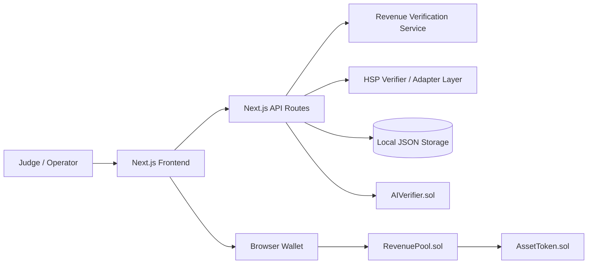
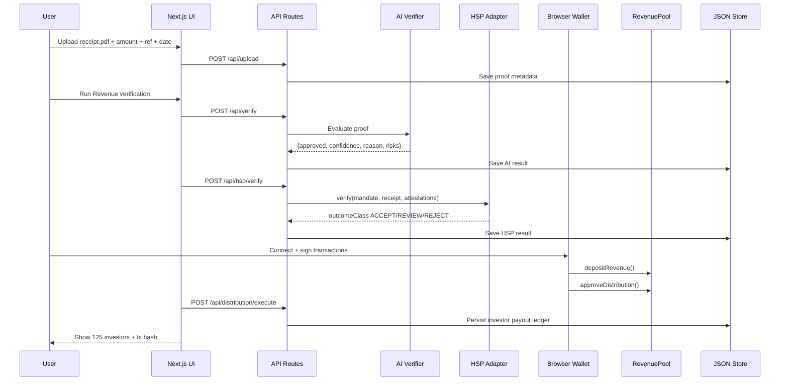
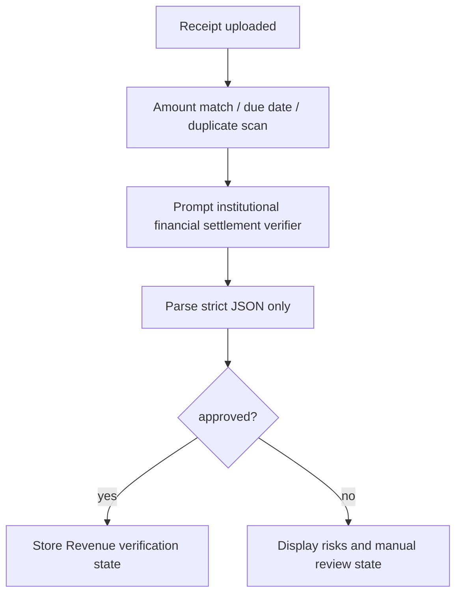
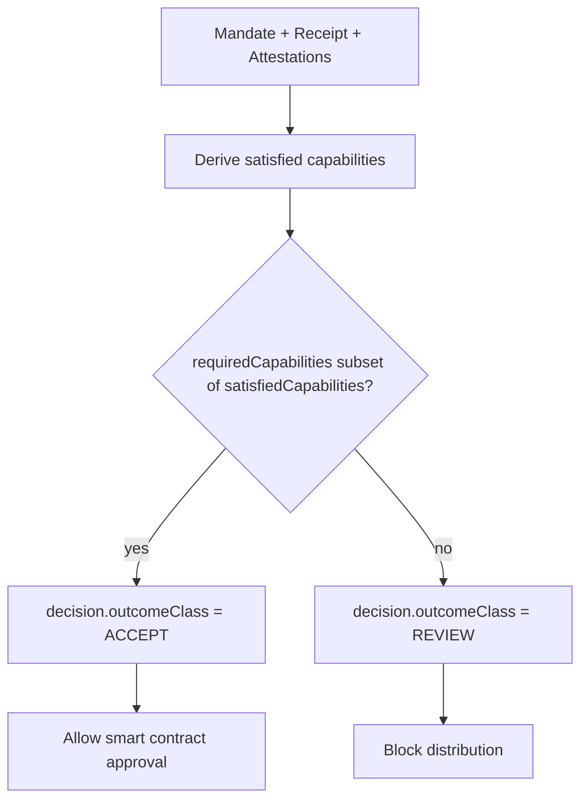

# Architecture Overview

AssetFlow AI uses a deliberately compact hackathon architecture:

- **Next.js App Router** serves the 6 demo screens and API routes.
- **Revenue verification service** runs inside the Next.js backend layer.
- **HSP adapter layer** applies a pinned adapter trust model and capability-based decisioning.
- **Hardhat contracts** provide the token, verification state anchor, and revenue distribution engine.
- **Local JSON storage** keeps asset, investor, and distribution state persistent enough for local demo use.

## High-level Architecture Diagram



## System Component Diagram

```mermaid
flowchart TB
  subgraph Next.js
    P1[Landing Page]
    P2[Dashboard]
    P3[Upload Revenue Proof]
    P4[Revenue Verification]
    P5[Approve Distribution]
    P6[Distribution Complete]
    R1[/api/upload]
    R2[/api/verify]
    R3[/api/hsp/verify]
    R4[/api/distribution/execute]
    R5[/api/dashboard]
  end

  subgraph Services
    S1[AI verifier service]
    S2[HSP verifier]
    S3[JSON data store]
  end

  subgraph Chain
    C1[AssetToken]
    C2[AIVerifier]
    C3[RevenuePool]
  end

  P3 --> R1 --> S3
  P4 --> R2 --> S1 --> S3
  P5 --> R3 --> S2 --> S3
  P5 --> C3
  C3 --> C1
  R4 --> S3
  R2 --> C2
```

## End-to-End Sequence Diagram



## Smart Contract Interaction Diagram

```mermaid
flowchart LR
  OwnerWallet -->|depositRevenue()| RevenuePool
  OwnerWallet -->|approveDistribution(hash, confidence)| RevenuePool
  Investor -->|claimReward()| RevenuePool
  RevenuePool -->|balanceOf / totalSupply| AssetToken
```

## Revenue Verification Workflow Diagram



## HSP Integration Flow Diagram


